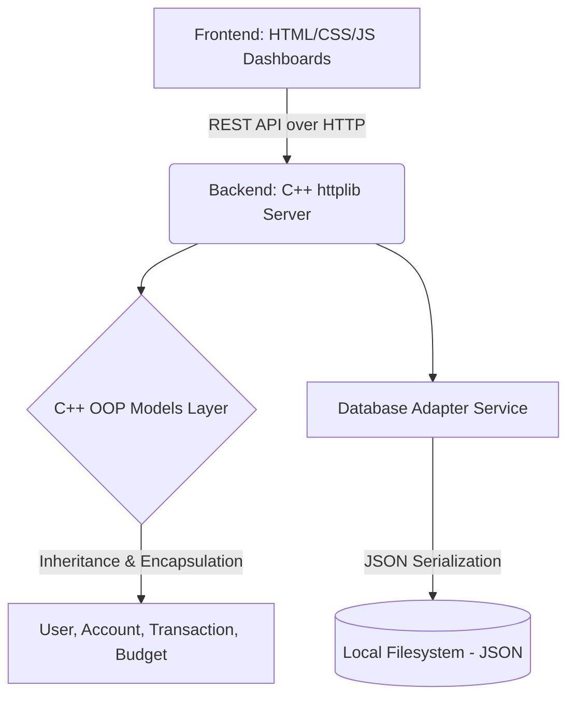

# Nexus Smart Expense Tracker - Complete OOPs Project Documentation

## Part 1: Presentation & Project Report Material

### 1. Title
**Nexus Smart Expense Tracker and Management System**
*An advanced Object-Oriented Financial Management Application*

### 2. Introduction
Personal finance management is critical for financial stability, yet many people struggle to manually track expenses, manage budgets, and monitor multiple bank accounts. The **Nexus Smart Expense Tracker** is a robust, full-stack application developed using purely Object-Oriented C++ principles for the backend and modern web technologies for the frontend. It provides users with a comprehensive dashboard to automatically track transactions, simulate virtual cards, monitor budgets, and establish financial goals.

### 3. Need and Scope
- **Need**: Traditional ledger books or simple spreadsheet-based tracking methods are error-prone, static, and difficult to manage. There is a need for an automated, secure, and intuitive system that categorizes spending and alerts the user of budget limits.
- **Scope**: The system is designed to handle multiple bank/cash accounts per user, track granular transactions across 14+ categories, manage monthly/yearly budgets, simulate virtual debit/credit cards with daily limits, and manage recurring subscriptions. It is scalable to be deployed on local servers as a Web App API.

### 4. Use Cases
1. **User Authentication & Profiles**: Securely register and login users with hashed credentials.
2. **Account Management**: Link physical cash or banking details to virtual tracked models.
3. **Transaction Logging**: Record income, expenses, and inter-account transfers.
4. **Budgeting Engine**: Set up "Food" or "Travel" budgets that automatically calculate warnings when users cross limits.
5. **Virtual Cards**: Instantly issue virtual cards mapped to accounts to strictly limit daily expenditures.
6. **Goal Tracking**: Create financial goals (e.g., "Buy a Car") and track deposit progress.

### 5. System Diagram & Architecture


### 6. Tools and Software Requirements
- **Frontend Technologies**: HTML5, Vanilla JavaScript, CSS3 (Custom Glassmorphism styling).
- **Backend Language**: C++ (C++17 Standard utilizing strict OOP concepts).
- **Backend Libraries**: `cpp-httplib` (for HTTP REST routing), `nlohmann_json` (for JSON parsing/serialization).
- **Compiler**: MinGW / GCC / w64devkit.
- **Environment**: Localhost web server simulation.

### 7. Methodology
The project follows the **Agile Development Methodology** and the **MVC (Model-View-Controller)** pattern:
- **Model**: Developed using pure C++ base classes and derived classes representing financial entities mapped strictly to Object-Oriented paradigms (Abstraction, Encapsulation, Inheritance, Polymorphism).
- **Controller**: `server_router.h` and `main.cpp` act as controllers intercepting frontend HTTP requests, manipulating the Models, and coordinating with the Database logic.
- **View**: The HTML structure rendered in the browser.
- Data persistence is achieved without heavy SQL engines by using file-based NoSQL-like JSON storage, allowing high-speed read/write for local OOPs demonstrations.

### 8. Conclusion
The Nexus Smart Expense Tracker effectively demonstrates that powerful, enterprise-grade backend systems can be architected using raw Object-Oriented C++. By structuring the application into clear entities that serialize themselves, the codebase remains highly modular, testable, and ready to scale.

### 9. References
- *The C++ Programming Language* by Bjarne Stroustrup
- `nlohmann/json` official documentation
- `cpp-httplib` standard repository documentation
- Modern Web Design Principles for Glassmorphism

---

## Part 2: Software Overview

### Languages Used
- **C++ (Backend)**: Drives the core business logic, mathematics, models, and HTTP server.
- **HTML/CSS (Frontend)**: Creates the aesthetic, responsive layout.
- **JavaScript (Frontend)**: Dynamically fetches API data from the C++ server and paints the graphs/data tables onto the DOM.

### File Structure & Usage
**Backend (C++)**
- `main.cpp`: Entry point. Initializes the database instance, passes it to the router, and starts the listener port (`8080`).
- `include/models.h` & `src/models.cpp`: Contains all the Object-Oriented Models (classes). Handles encapsulation of properties.
- `include/database.h` & `src/database.cpp`: The data access layer. Implements file IO using `nlohmann/json` to load and save C++ objects permanently.
- `include/server_router.h` & `src/server_router.cpp`: Maps specific URLs (like `/api/transactions`) to C++ lambda functions that trigger database reads/writes.
- `include/httplib.h` & `include/json.hpp`: Third-party header-only dependencies required for web routing and JSON string manipulation.

**Frontend (Web UI)**
- `index.html`: The landing and authentication page.
- `dashboard.html`: The massive single-page application orchestrating the UI.
- `css/styles.css`, `css/dashboard.css`: Contains CSS rules, including `backdrop-filter: blur`, flex-box grids, and animations.
- `js/app.js`, `js/dashboard.js`: Contains AJAX/Fetch API calls mapping UI button clicks to the C++ server.

---

## Part 3: Deep Explanation of C++ Object-Oriented Code

### 1. Abstraction and Base Level Design
The core of the software revolves around an abstract base class `Entity` declared in `models.h`.
```cpp
class Entity {
protected:
    std::string id;
    std::time_t createdAt;
    std::time_t updatedAt;
public:
    Entity();
    virtual ~Entity() = default;
    // Getters and setters
    virtual json toJson() const = 0;
    virtual void fromJson(const json& j) = 0;
};
```
**OOP Concept Used:**
- **Abstraction**: `Entity` contains pure virtual functions (`= 0`), making it an Abstract Base Class. You cannot instantiate an `Entity` directly, ensuring consistency.
- **Inheritance**: Every other class in the application (`User`, `Account`, `Transaction`) publicly inherits from `Entity`, gaining automatic timestamp and ID tracking functionalities without duplicate code.

### 2. Encapsulation inside Models
In classes like `VirtualCard` or `Budget`, all data members are marked `private:`.
```cpp
class Account : public Entity {
private:
    std::string userId;
    std::string accountName;
    AccountType type;
    double balance;
// ...
public:
    void deposit(double amount);
    bool withdraw(double amount);
};
```
**OOP Concept Used:**
- **Encapsulation**: The standard user or the backend router cannot casually change the `balance` variable (it is hidden/private). They *must* use the `deposit()` or `withdraw()` methods.
- The `withdraw()` method checks if `amount > balance` inside `models.cpp` and returns `false` if true, preventing invalid database states. This validates the data internally.

### 3. Polymorphism and Serialization Interfaces
Since the database must read/write to files, the system uses Polymorphism to parse the specific objects back and forth to JSON.
Because `Account` inherits from `Entity`, it provides a concrete implementation of `toJson()`:
```cpp
json Account::toJson() const {
    json j;
    j["id"] = id; // inherited from Entity
    j["userId"] = userId;
    j["accountName"] = accountName;
    j["balance"] = balance;
    return j;
}
```
**OOP Concept Used:**
- **Runtime Polymorphism (Overriding)**: The database module contains collections of these models. When saving to disk, it safely loops over them, calling their overridden `.toJson()` functions.

### 4. Advanced Component: Budget Handling Logic
```cpp
void Budget::addExpense(double amount) {
    currentSpent += amount;
    updateTimestamp(); // Inherited method updates the Entity date naturally
}

bool Budget::isExceeded() const {
    return currentSpent > limitAmount;
}
```
This maps directly to the real world. Whenever a `Transaction` is logged, if the Category matches a `Budget` category, the router grabs the Budget object and calls `addExpense(amount)`, abstracting the heavy logic strictly to the Model level.

### 5. Memory Management and System Control
The system heavily utilizes heap allocators, `std::vector`, and standard namespace features via C++ standard templates (`STL`). 
The core data models are structured into `std::vector<models::Transaction>` and loaded directly into RAM when the `Database` singleton class is instantiated in `main.cpp`. This significantly reduces read times when compared to SQL databases, acting as an in-memory application architecture highly suitable for localized desktop backend apps.
